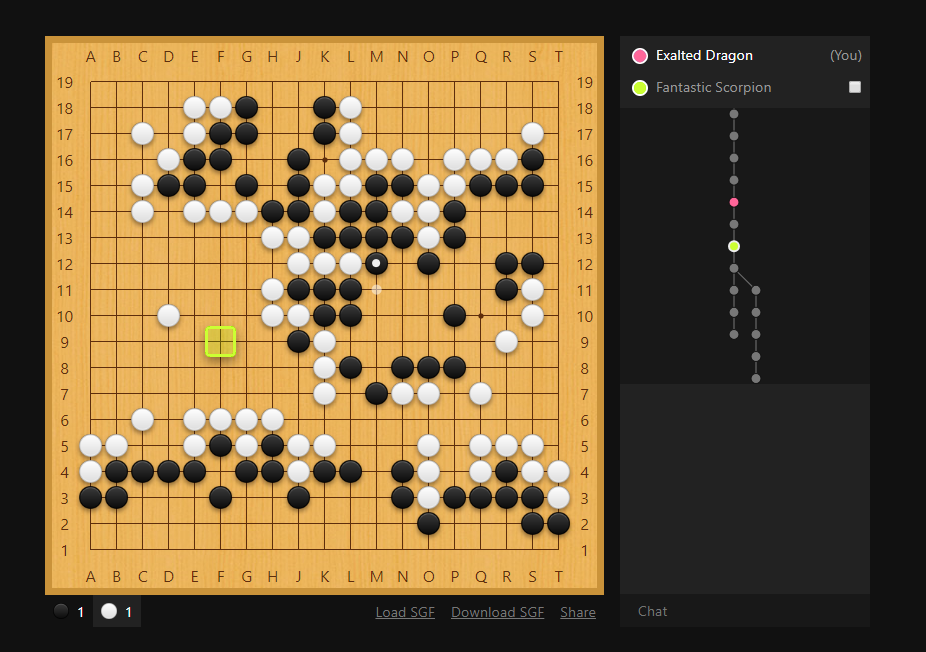

# p2p-goban

Connect to multiple peers and play/analyze on a shared Goban. This is a proof of concept and I hope that all functionalities will eventually be integrated into [Sabaki](https://github.com/SabakiHQ/Sabaki). [Try it out here](https://p2p-goban.yichuanshen.de/).

First, you connect to a server to see who's there. Then, peers share the game tree with each other peer-to-peer. There's no centralized server that saves your game. We use WebRTC, so all communication between peers are encrypted.

## Features

- Connect to other people peer-to-peer
- Play a game or analyze games together in real time
- Chat with other peers
- Upload SGF files
- Download game as an SGF file
- Follow a peer to see what they see
- Right-click to highlight vertices to signal peers what you're looking at

## Building

Building requires Node.js and npm. First, clone this repository and install all the dependencies:

~~~
$ git clone https://github.com/yishn/p2p-goban
$ cd p2p-goban
$ npm install
~~~

Start a [`signalhub`](https://github.com/mafintosh/signalhub) server with npx:

~~~
$ npx signalhub listen -p 51624
~~~

Open `config.example.json`, add the URL to your `signalhub` server, `http://localhost:51624` in this example, and save it under `config.json`.

For development, use the following command to create a bundle automatically while you edit files:

~~~
$ npm run watch
~~~

For production, use the following command instead:

~~~
$ npm run build
~~~

Open `index.html` in a modern browser.

## Related Projects

- [Shudan](https://github.com/SabakiHQ/Shudan) - A highly customizable, low-level Preact Goban component.
- [go-board](https://github.com/SabakiHQ/go-board) - A Go board data type.
- [crdt-gametree](https://github.com/SabakiHQ/crdt-gametree) - A conflict-free replicated game tree data type.
- [sgf](https://github.com/SabakiHQ/sgf) - A library for parsing and creating SGF files.
